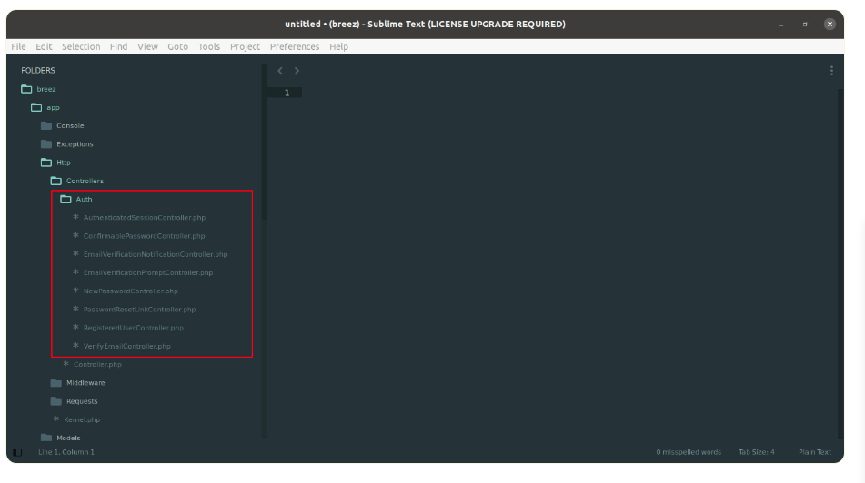
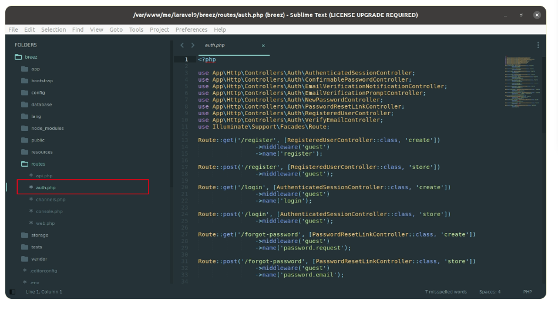
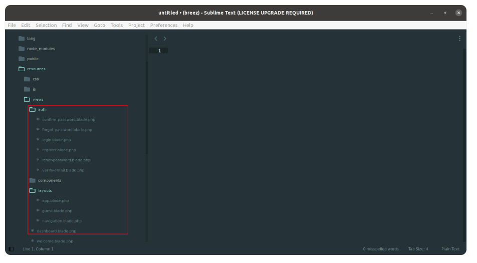
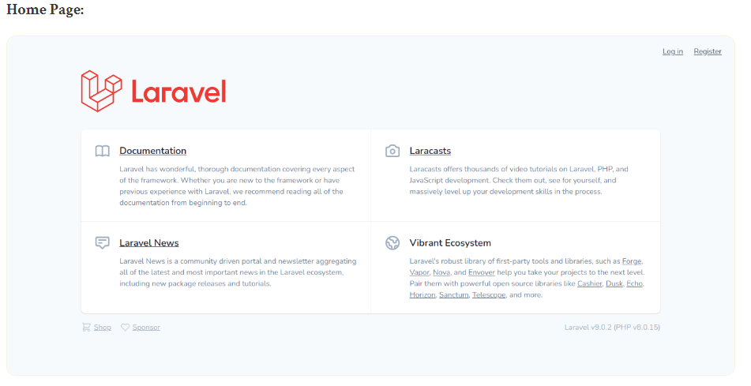
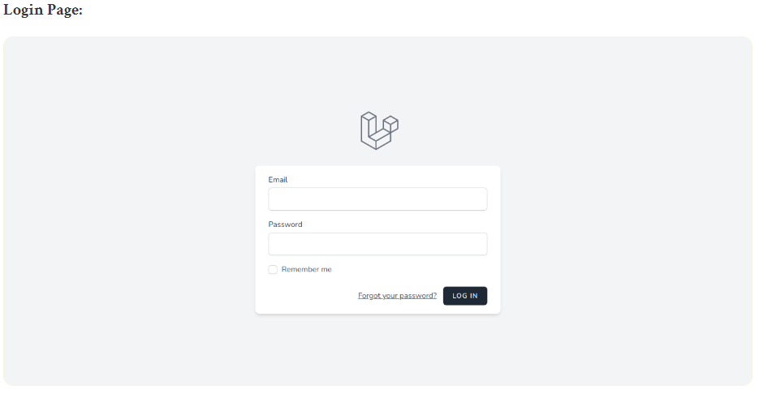
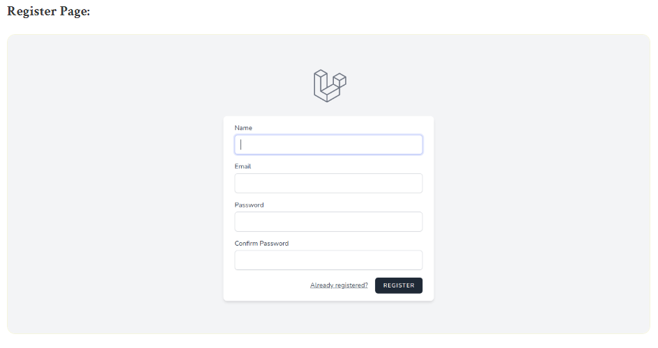
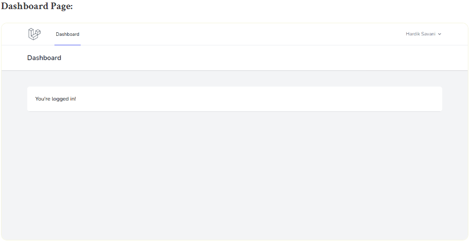

# laravel9_authentication_using_breeze
## 1. Install Laravel 9
```Dockerfile
composer create-project laravel/laravel laravel9_authentication_using_breeze
```
- Install Breeze
```Dockerfile
composer require laravel/breeze --dev
```
- command chạy 
```Dockerfile
php artisan breeze:install
```
```Dockerfile
npm install && npm run dev
```
```Dockerfile
php artisan migrate
```
- Xem những tệp được tạo ra : Vào Generated Controller Files:



Tệp router đã tạo:



 Blade Files:
 
 
 
 ## 2.Run Laravel App:
 ```Dockerfile
php artisan serve
```
- Vào http://localhost:8000/

 
 
 
 
